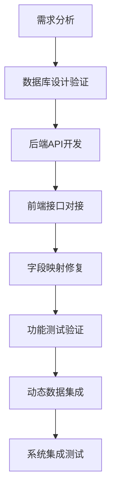

# 商品管理功能开发流程规范

## 📋 概述

本文档总结了商城后台管理系统中商品管理功能的完整开发流程，包括字段映射修复、API接口实现、分类管理系统构建等关键步骤。

## 🛠️ 技术栈

- **前端**: Vue3 + TypeScript + Element Plus + Vite
- **后端**: Spring Boot 3.1.5 + MyBatis Plus + MySQL 8.0
- **开发环境**: Windows + PowerShell + Node.js 20.13.1 + Java 17

## 📊 开发流程总览



## 🔧 详细开发步骤

### 第一阶段：问题诊断与修复

#### 1.1 字段映射不一致问题解决

**问题描述**：
- 前后端字段名不匹配：`stockQuantity/salesCount` vs `stock/sales`
- 现价字段不匹配：数据库 `current_price` vs 后端DTO `price`

**解决方案**：
```java
// ProductResponse.java 修复字段映射
public class ProductResponse {
    private Integer stockQuantity;  // 统一使用 stockQuantity
    private Integer salesCount;     // 统一使用 salesCount  
    private BigDecimal currentPrice; // 统一使用 currentPrice
    
    // ... getter/setter方法
}
```

**关键修复文件**：
- `d:\商城后台\mall-admin-backend\src\main\java\com\mall\admin\dto\response\ProductResponse.java`
- `d:\商城后台\mall-admin-backend\src\main\java\com\mall\admin\service\impl\ProductServiceImpl.java`

#### 1.2 商品状态管理API实现

**需求**：实现商品上下架功能

**实现步骤**：
1. **后端API开发**：
```java
// ProductController.java
@PatchMapping("/{id}/status")
public ApiResponse<Void> updateProductStatus(
    @PathVariable Integer id,
    @RequestBody Map<String, Integer> request) {
    Integer status = request.get("status");
    productService.updateProductStatus(id, status);
    return ApiResponse.success();
}
```

2. **服务层实现**：
```java
// ProductServiceImpl.java
public void updateProductStatus(Integer id, Integer status) {
    // 参数验证
    if (id == null || id <= 0) {
        throw new IllegalArgumentException("商品ID不能为空");
    }
    if (status == null || (status != 0 && status != 1)) {
        throw new IllegalArgumentException("状态值无效");
    }
    
    // 更新状态
    Product product = new Product();
    product.setProductId(id);
    product.setStatus(status);
    productMapper.updateById(product);
}
```

### 第二阶段：分类管理系统开发

#### 2.1 分类服务层实现

**创建文件**：`CategoryServiceImpl.java`

**核心功能**：
- 分页查询分类列表
- 分类CRUD操作
- 分类树结构构建
- 批量状态更新

```java
// CategoryServiceImpl.java 关键代码片段
@Override
public PageResult<CategoryResponse> getCategoryList(Integer page, Integer size, String keyword, Integer parentId) {
    Page<Category> pageObj = new Page<>(page, size);
    LambdaQueryWrapper<Category> queryWrapper = new LambdaQueryWrapper<>();
    
    // 添加查询条件
    if (StringUtils.hasText(keyword)) {
        queryWrapper.like(Category::getCategoryName, keyword);
    }
    if (parentId != null) {
        queryWrapper.eq(Category::getParentId, parentId);
    }
    
    Page<Category> resultPage = categoryMapper.selectPage(pageObj, queryWrapper);
    // 转换为响应DTO
    return convertToPageResult(resultPage);
}
```

#### 2.2 分类控制器实现

**创建文件**：`CategoryController.java`

**RESTful API设计**：
```java
@RestController
@RequestMapping("/api/categories")
public class CategoryController {
    
    @GetMapping
    public ApiResponse<PageResult<CategoryResponse>> getCategoryList(
        @RequestParam(defaultValue = "1") Integer page,
        @RequestParam(defaultValue = "10") Integer size,
        @RequestParam(required = false) String keyword,
        @RequestParam(required = false) Integer parentId) {
        // 实现分页查询
    }
    
    @GetMapping("/tree")
    public ApiResponse<List<CategoryResponse>> getCategoryTree() {
        // 返回分类树结构
    }
}
```

### 第三阶段：新增商品功能修复

#### 3.1 缺失字段问题诊断

**错误信息**：
```
Field 'original_price' doesn't have a default value
```

**根因分析**：
- `ProductRequest.java` 缺少必需字段
- 数据库表定义了非空字段但DTO未包含

#### 3.2 修复方案实施

**修复文件**：`ProductRequest.java`

```java
public class ProductRequest {
    // 添加缺失字段
    @DecimalMin(value = "0.01", message = "原价必须大于0")
    private BigDecimal originalPrice;
    
    @DecimalMin(value = "0.01", message = "成本价必须大于0") 
    private BigDecimal costPrice;
    
    @DecimalMin(value = "0.01", message = "促销价必须大于0")
    private BigDecimal promotionPrice;
    
    // getter/setter方法
    public BigDecimal getOriginalPrice() { return originalPrice; }
    public void setOriginalPrice(BigDecimal originalPrice) { this.originalPrice = originalPrice; }
    // ... 其他方法
}
```

### 第四阶段：前端动态数据集成

#### 4.1 分类数据动态加载

**目标**：将静态分类选项替换为API动态获取

**修改文件**：`List.vue`

**关键实现**：
```typescript
// 导入分类API
import { categoryAPI, type CategoryResponse } from '@/api/category'

// 添加状态管理
const categoriesLoading = ref(false)
const categoryList = ref<CategoryResponse[]>([])

// 动态加载分类数据
const loadCategoryList = async () => {
  categoriesLoading.value = true
  try {
    const response = await categoryAPI.getCategoryList({
      page: 1,
      size: 1000,
      status: 1 // 只获取启用的分类
    })
    categoryList.value = response.records || []
  } catch (error: any) {
    ElMessage.error(`加载分类列表失败：${error.message || '未知错误'}`)
  } finally {
    categoriesLoading.value = false
  }
}
```

**模板更新**：
```vue
<el-select
  v-model="searchForm.categoryId"
  placeholder="请选择分类"
  clearable
  :loading="categoriesLoading"
>
  <el-option
    v-for="category in categoryList"
    :key="category.categoryId"
    :label="category.categoryName"
    :value="category.categoryId"
  />
</el-select>
```

## 🧪 测试验证流程

### 4.1 API接口测试

**测试命令**：
```powershell
# 测试新增商品API
Invoke-RestMethod -Uri "http://localhost:8080/api/products" -Method POST -ContentType "application/json" -Body '{"productName":"测试商品","productCode":"TEST001","categoryId":1,"currentPrice":99.99,"originalPrice":199.99,"stockQuantity":100,"status":1}'

# 测试分类列表API
Invoke-RestMethod -Uri "http://localhost:8080/api/categories?page=1&size=1000" -Method GET
```

**预期结果**：
- 状态码：200
- 响应：`{"code":200,"message":"操作成功","success":true}`

### 4.2 前端功能测试

**测试项目**：
1. ✅ 商品列表加载
2. ✅ 分类下拉框动态数据
3. ✅ 商品状态切换（上架/下架）
4. ✅ 新增商品功能
5. ✅ 商品编辑功能

## 🔍 常见问题与解决方案

### 问题1：字段映射不一致

**症状**：前端显示异常，数据为空或undefined

**解决步骤**：
1. 检查数据库字段名
2. 确认DTO字段命名
3. 验证前端接口类型定义
4. 统一所有层级的字段名

### 问题2：API 404错误

**症状**：前端调用后端接口返回404

**解决步骤**：
1. 检查Controller路由映射
2. 确认RequestMapping路径
3. 验证HTTP方法（GET/POST/PUT/DELETE）
4. 检查参数绑定

### 问题3：数据库字段缺失默认值

**症状**：插入数据时报"Field doesn't have a default value"

**解决步骤**：
1. 检查数据库表结构
2. 确认DTO包含所有必需字段
3. 添加字段验证注解
4. 实现getter/setter方法

## 🚀 部署运行指南

### 启动后端服务

```powershell
# 进入后端项目目录
Push-Location "d:\商城后台\mall-admin-backend"

# 编译并启动
mvn clean compile
mvn spring-boot:run
```

### 启动前端服务

```powershell
# 进入前端项目目录
Push-Location "d:\商城后台\vue3-admin"

# 安装依赖并启动
npm install
npm run dev
```

**访问地址**：
- 前端：http://localhost:3002
- 后端API：http://localhost:8080
- 接口文档：http://localhost:8080/api/swagger-ui.html

## 📋 开发规范总结

### 代码规范

1. **字段命名一致性**：确保数据库、后端DTO、前端接口的字段名保持一致
2. **API设计规范**：遵循RESTful设计原则
3. **错误处理**：统一异常处理和错误提示
4. **数据验证**：添加必要的参数验证和业务校验

### 开发流程

1. **需求分析** → **数据库设计** → **后端API** → **前端对接** → **测试验证**
2. **增量开发**：先实现核心功能，再完善细节特性
3. **及时测试**：每个功能点完成后立即进行API测试
4. **文档同步**：及时更新接口文档和开发文档

### 质量保证

1. **单元测试**：关键业务逻辑需要编写单元测试
2. **集成测试**：完整的API调用链路测试
3. **用户体验**：界面响应速度、错误提示、加载状态
4. **代码审查**：关注代码质量、性能优化、安全性

## 🎯 项目成果

经过完整的开发流程，成功实现了以下功能：

- ✅ **商品列表管理**：分页查询、条件筛选、状态管理
- ✅ **商品CRUD操作**：新增、编辑、删除、状态切换
- ✅ **分类管理系统**：动态分类加载、分类树结构
- ✅ **数据一致性**：前后端字段映射统一
- ✅ **用户体验优化**：加载状态、错误提示、界面响应

## 📚 参考文档

- [Spring Boot官方文档](https://spring.io/projects/spring-boot)
- [Vue3官方文档](https://vuejs.org/)
- [Element Plus组件库](https://element-plus.org/)
- [MyBatis Plus文档](https://baomidou.com/)

---

**文档版本**：v1.0  
**创建时间**：2025-09-10  
**最后更新**：2025-09-10  
**维护人员**：商城后台开发团队